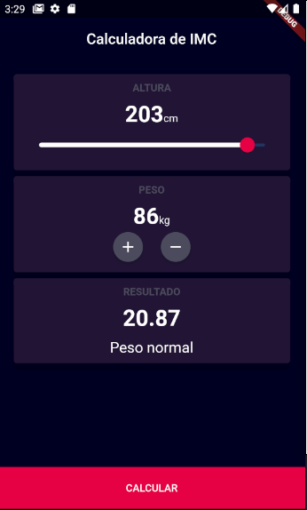

<h1 align="center">
   
</h1>
<h1 align="center" width="50%">
  
  
</h1>

## ⚡️ The Project - BMI Calculator
  This is a simple Flutter application that allows the user to calculate it's BMI
## 🎯 Features
 - Slider
 - Conditional rendering
  
## 🖥️ Used Tecnologies
- [Flutter](https://flutter.dev/)

## ⚙️ Dependencies
 - [AndroidStudio](https://developer.android.com/studio)
 - [Flutter](https://flutter.dev/)
 
## 🚀️ Getting Started

1. Clone this repository: 

```bash
git clone https://github.com/avnerjose/flutter-emi-calculator.git && cd flutter-emi-calculator
```
2. Start your AVD


3. Run the app 
```bash
flutter run
```
